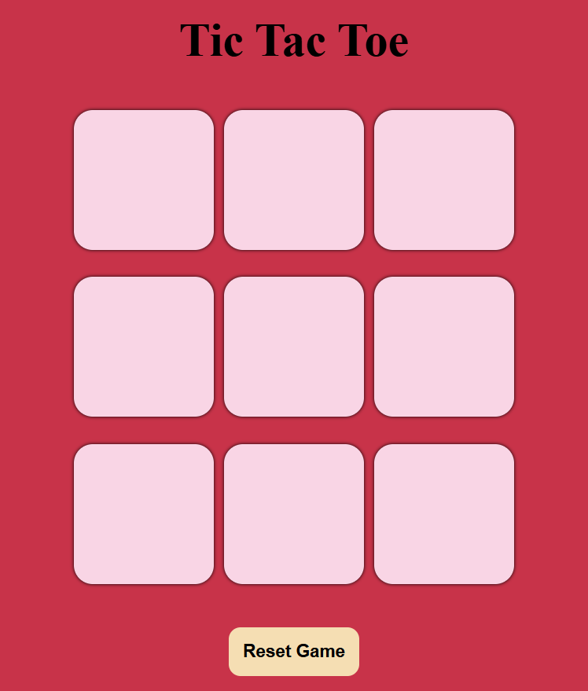

# Tic-Tac-Toe Game

A simple browser-based Tic-Tac-Toe game built using **HTML**, **CSS**, and **JavaScript**. Play against a friend and test your strategic skills!

## Features
- Two-player mode.
- Highlights the winning combination.
- Reset button to start a new game.
- "New Game" button to restart the game with a fresh board.
- Responsive design for seamless play on any device.

## How to Run
1. Clone the repository or download the files.
2. Open the `index.html` file in your browser.
3. Start playing!

## Technologies Used
- **HTML**: Markup for the game structure.
- **CSS**: Styling for the game board and layout.
- **JavaScript**: Logic for gameplay, including win detection, resets, and the "New Game" functionality.

## Screenshot

